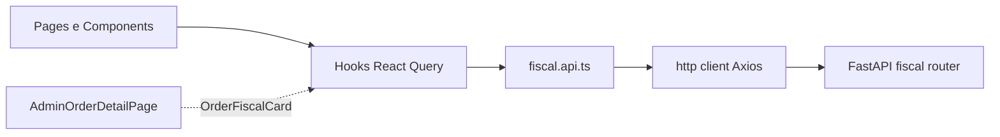

# Módulo Fiscal (NF-e) — Frontend

Interface de gestão de Notas Fiscais Eletrónicas (NF-e) integrada com o backend
em [`backend/app/modules/fiscal/`](../../../../../backend/app/modules/fiscal/).
Permite acompanhar emissões, baixar XML/DANFE, reenviar e cancelar notas, e
emitir manualmente a partir de um pedido.

## Como ativar

- O módulo está em `MODULE_IDS` (`'fiscal'`) e ativo por defeito (`DEFAULT_ON`).
- Permissões espelhadas no backend:
  - `fiscal.read` → `PERMISSIONS.FISCAL_VIEW`
  - `fiscal.write` → `PERMISSIONS.FISCAL_WRITE`
- Variáveis de ambiente:
  - `VITE_USE_FISCAL_MOCK=true` → ativa mocks locais para desenvolvimento offline. Default: **API real**.

## Mapa de componentes

```
src/modules/admin/fiscal/
├── README.md
├── types.ts                       — tipos e estados fiscais (espelham schemas Pydantic)
├── schemas/
│   └── cancelInvoice.schema.ts    — Zod: justificativa min 15 / max 255
├── services/
│   └── fiscal.api.ts              — chamadas HTTP + mocks
├── hooks/
│   ├── useFiscalInvoicesList.ts
│   ├── useFiscalInvoiceDetail.ts  — polling adaptativo enquanto status === 'processando'
│   ├── useEmitInvoice.ts          — mutation (toast)
│   ├── useCancelInvoice.ts        — mutation (toast)
│   ├── useFiscalSettings.ts
│   ├── useFiscalDashboardKpis.ts  — agregação client-side
│   └── useDownloadInvoiceFile.ts  — XML / PDF via Blob + download trigger
├── components/
│   ├── InvoiceStatusBadge.tsx
│   ├── SefazStatusBadge.tsx
│   ├── FiscalKpiStrip.tsx         — KPIs do painel
│   ├── InvoicesFilters.tsx
│   ├── InvoicesTable.tsx          — @tanstack/react-table com ordenação
│   ├── InvoiceSummaryCard.tsx
│   ├── InvoiceItemsTable.tsx
│   ├── InvoiceTaxesPanel.tsx
│   ├── InvoiceTimeline.tsx        — eventos derivados (created_at, protocolo, last_error...)
│   ├── InvoiceActionsBar.tsx      — baixar XML/PDF, reenviar, cancelar
│   ├── CancelInvoiceDialog.tsx    — confirma + força justificativa ≥ 15
│   ├── EmitInvoiceDialog.tsx      — confirma emissão / reenvio
│   └── OrderFiscalCard.tsx        — usado em /admin/pedidos/:id
└── pages/
    ├── FiscalDashboardPage.tsx    — /admin/fiscal/painel
    ├── FiscalInvoicesListPage.tsx — /admin/fiscal/notas
    └── FiscalInvoiceDetailPage.tsx — /admin/fiscal/notas/:invoiceId
```

## Fluxo de dados



- Auth: token JWT em `Authorization` (interceptor em `services/http/client.ts`).
- Tenant: header `X-Tenant-Id` no request.
- `company_id` numérico: hook `useCurrentCompanyId()` faz parse de `tenant.id`.

## Contrato de endpoints

Backend espera prefixo `/companies/{company_id}`. Endpoints consumidos:

| Verbo  | Path                                                | Uso                              |
|--------|-----------------------------------------------------|----------------------------------|
| GET    | `/companies/{id}/invoices`                          | Listar notas (filtros + pag.)    |
| GET    | `/companies/{id}/invoices/{invoiceId}`              | Detalhe da nota                  |
| GET    | `/companies/{id}/invoices/{invoiceId}/xml`          | Download do XML (blob)           |
| GET    | `/companies/{id}/invoices/{invoiceId}/pdf`          | Download do DANFE PDF (blob)     |
| POST   | `/companies/{id}/invoices/emit`                     | Enfileirar emissão por `order_id`|
| POST   | `/companies/{id}/invoices/{invoiceId}/cancel`       | Cancelar (com justificativa)     |
| GET    | `/companies/{id}/fiscal/settings`                   | Ambiente, CNPJ emitente, etc.    |

Detalhes em [`backend/docs/fiscal-nfe.md`](../../../../../backend/docs/fiscal-nfe.md).

## UX/UI

- Estados em tempo real: `useFiscalInvoiceDetail` faz refetch a cada 3 s enquanto
  `status ∈ {processando, pendente}`. Encerra automaticamente ao chegar em
  estado final.
- Toasts (`sonner`) para sucesso/erro de emissão, cancelamento e download.
- Loading: `Skeleton` em listas, tabelas e KPIs.
- Responsivo: KPIs em `grid sm:grid-cols-2 lg:grid-cols-5`, tabelas com
  `overflow-x-auto`.

## Segurança

- `RequireModuleRoute moduleId="fiscal"` + `RequirePermission anyOf=[FISCAL_VIEW]`
  em todas as rotas.
- Botões de escrita (Cancelar, Reenviar, Emitir) ocultos se o utilizador não
  tem `FISCAL_WRITE`.
- Cancelamento exige justificativa entre 15 e 255 caracteres (mesma regra do
  backend).

## Melhorias futuras

- Endpoint dedicado `/companies/{id}/fiscal/dashboard` para os KPIs (hoje agregados
  client-side a partir das últimas 200 notas).
- Endpoint de timeline de eventos (`/invoices/{id}/events`) — hoje derivamos da
  combinação `created_at` / `updated_at` / `protocolo` / `last_error`.
- Endpoint dedicado de status SEFAZ (hoje inferido de `settings.environment` +
  taxa de rejeições).
- WebSocket / SSE para emissão em tempo real (substituiria o polling de 3 s).
- UI de **inutilização de numeração** (`POST /invoices/inutilize` já existe no
  backend).
- Página de **configurações fiscais** (`GET/PUT /fiscal/settings`) — hoje apenas
  exibimos um resumo no painel.
- Página de **histórico de inutilizações** (`GET /fiscal/inutilizations`).
- Logs de ações visuais (auditoria) — hoje confiamos no audit log do backend.
